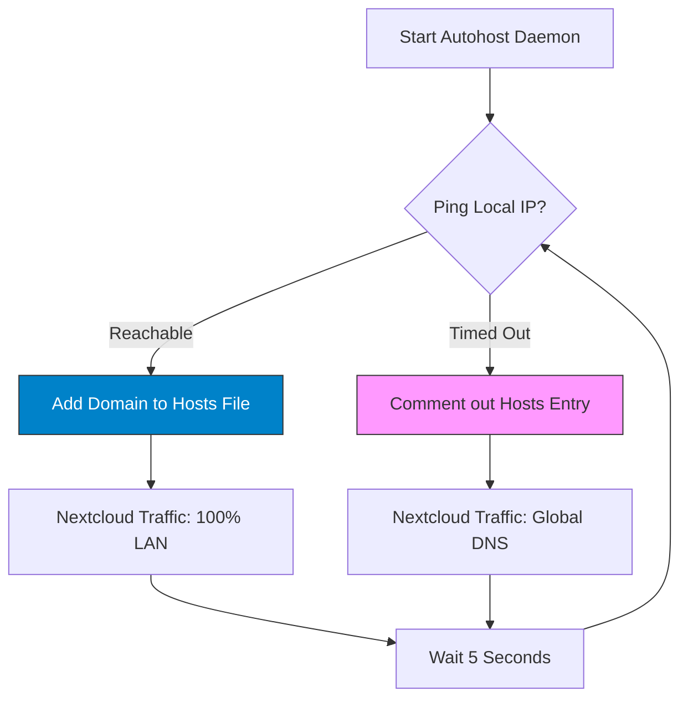

# ☁️ Nextcloud Autohost

<p align="center">
  
  
  
  
</p>

<p align="center">
  <strong>Zero-Latency Local Routing for your Self-Hosted Cloud.</strong>
  <br />
  Automatically switch between LAN and WAN IPs to ensure the fastest possible connection to your Nextcloud server.
</p>

---

## 📖 The "Why"

If you host Nextcloud at home, you’ve likely faced this dilemma: 
1. **At Home:** You want gigabit LAN speeds, but your domain points to your public IP, routing your traffic out to the internet and back (Hairpin NAT), which is often slow or unsupported by routers.
2. **Away:** You need your domain to resolve via global DNS to access your files over the internet.

**Nextcloud Autohost** is a "set-and-forget" daemon that monitors your connection. When you're home, it injects a local override into your system's `hosts` file. When you leave, it cleans it up. 

---

## ✨ Features

*   **🔍 Intelligence Detection:** Periodically pings your local Nextcloud instance to verify reachability.
*   **⚡ Instant Speed Boost:** Routes traffic directly over your LAN, bypassing internet bandwidth limits and router bottlenecks.
*   **🔄 Cross-Platform Daemon:**
    *   **Linux:** Integrates as a native `systemd` service with auto-restart logic.
    *   **Windows:** Installs as a silent background process via the `Startup` folder.
*   **🛠️ Zero-Dependency Setup:** Automatically installs the Python `requests` module if missing.
*   **🧹 Non-Destructive Cleanup:** Built-in uninstaller reverts all system startup entries and systemd units.

---

## 🧬 How It Works



---

## 🚀 Getting Started

### 1. Pre-Configuration
Before running the script, you **must** define your specific server details inside `nextcloud_autohost.py`:

```python
# Open the script and edit these lines:
TARGET_IP = "192.168.1.x"    # Your server's local IP
DOMAIN = "cloud.yourdomain.com" # Your Nextcloud domain
```

### 2. Installation
The script requires Administrator (Windows) or Root (Linux) privileges to modify the system hosts file.

```bash
# Run the auto-installer
python3 nextcloud_autohost.py --install
```

### 3. Verification
*   **Linux:** Check service status with `systemctl status nextcloud_autohost.service`.
*   **Windows:** Look for the python process in Task Manager or check your `shell:startup` folder.

---

## 🛠️ Technical Breakdown

| Component | Linux Implementation | Windows Implementation |
| :--- | :--- | :--- |
| **Persistence** | `systemd` Unit File | `.bat` in `AppData\Roaming\...\Startup` |
| **Execution** | Background Service | `pythonw.exe` (No console window) |
| **Hosts Path** | `/etc/hosts` | `C:\Windows\System32\drivers\etc\hosts` |
| **Privileges** | Requires `sudo` | Requires "Run as Administrator" |

---

## 🧹 Uninstallation

To stop the background monitoring and remove all autostart entries:

```bash
python3 nextcloud_autohost.py --uninstall
```
*Note: This removes the service/startup link. To stop the current running process immediately, a system reboot or manual task kill is recommended.*

---

## ⚠️ Important Notes

*   **Static IP Recommended:** Ensure your Nextcloud server has a static local IP, or the script will lose track of it.
*   **VPN Warning:** If you use a VPN that routes all traffic, it may interfere with the local ping detection.
*   **Self-Hosting Only:** This tool is designed for private home servers, not for public-facing enterprise environments.

---

## 📜 License

Distributed under the **MIT License**. See `LICENSE` for more information.

---
<p align="center">
  Optimizing the self-hosted experience. 🚀
</p>
